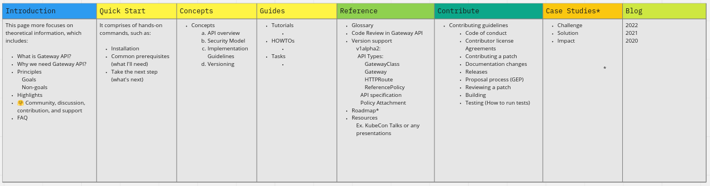

# Assessment: Project Kubernetes Gateway API

Prepared by: Meha Bhalodiya
([@mehabhalodiya](https://github.com/mehabhalodiya))  Date: 2021-03-03

## Introduction

This document assesses the quality and completeness of the Kubernetes Gateway
API [project's](https://github.com/kubernetes-sigs/gateway-api) documentation
and [website](https://gateway-api.sigs.k8s.io/).

This document:

- Measures existing documentation quality against the CNCF’s standards
- Recommends specific and general improvements
- Provide examples of great documentation as a reference
- Identifies key improvements with the largest return on investment

## How this document works

The assessment is divided into three sections:

- **Project documentation:** for end-users of the project; aimed at people who
  intend to use it
- **Contributor documentation:** for new and existing contributors to the
  project
- **Website:** branding, website structure, and maintainability

Each section rates content based on different
[criteria](../docs/analysis/criteria.md).

## Project documentation

| Criteria                                 | 1   | 2   | 3   | 4   | 5   |
| ---------------------------------------- | --- | --- | --- | --- | --- |
| Information architecture                 |     | ✅  |     |     |     |
| New user content                         |     |     | ✅  |     |     |
| Content maintainability & site mechanics |     |     |     | ✅  |     |
| Content creation processes               |     |     |     | ✅  |     |

Scale:

- 1 = (Is not present or requires significant work)
- 3 = (Is present, but needs work)
- 5 = (Is executed extremely well or no improvement required)

### Comments

**Information architecture**:

The brief information is mentioned on
[the Introductory](https://gateway-api.sigs.k8s.io/) page, but we need to
organize it well. Also,
[API conventions](https://gateway-api.sigs.k8s.io/concepts/guidelines/?h=api+conve#api-conventions)
are mentioned in brief, great work!

**New user content**:

We have a great, clearly labelled
[Getting Started](https://gateway-api.sigs.k8s.io/v1alpha2/guides/getting-started/?no-link-check)
page, which is awesome! However, the getting started guide is fairly high level
and doesn't answer some of the following questions:

- What are the prerequisites that need to be installed beforehand? Or What else
  do I need aside from Gateway Controller?

* Where to go and what to do after reading the “Getting Started” guide?

**Content maintainability**:

Our documentation is searchable, which is great!

**Content creation processes**:

The [Contributing Guide](https://gateway-api.sigs.k8s.io/contributing/devguide/)
contains really thorough documentation on contributing to both docs and the
project itself! In the
[README](https://github.com/kubernetes-sigs/gateway-api#readme), maintainers are
not
[clearly documented](https://github.com/kubernetes-sigs/gateway-api/blob/master/OWNERS_ALIASES)
as well as where to find them.

### Recommendations

**Information architecture:**

- The main task with information architecture is conceptualization and
  development as the documents are currently in different places. The following
  areas would establish a foundation:

  - Introduction
  - Quick Start
  - Concepts
  - Tutorials
  - Reference
  - Contribute

- **Prepared a miro board:
  [https://miro.com/app/board/uXjVO_1cS9k=/](https://miro.com/app/board/uXjVO_1cS9k=/)**

  

- There are improvements we could make:
  - With the collection of guided, step-by-step instructions (tasks, hands-on
    tutorials) documented for features, it would be easy to learn and explore
    this project.
  - [Gateway API Concepts](https://gateway-api.sigs.k8s.io/#gateway-api-concepts)
    should go somewhere inside the Concepts section of the Overview page.

**Content maintainability**:

- We need to add some information regarding “**How do we update the code for new
  versions?**”, and “**How do we update the documentation when a new version is
  released?**”.

- In short, we need to write up the process for versioning the documentation. \
  Reference: [https://cluster-api.sigs.k8s.io/contributing#versioning](https://cluster-api.sigs.k8s.io/contributing#versioning)

**Content creation processes**:

We can put up a MAINTAINERS.md file for tagging & contact purposes in the
project repo. We may want to look into how to get the API stuff
[here](https://clomonitor.io) to track some of the docs requirements, like a
MAINTAINERS file.

## Contributor documentation

| Criteria                                  | 1   | 2   | 3   | 4   | 5   |
| ----------------------------------------- | --- | --- | --- | --- | --- |
| Communication methods documented          |     |     |     |     | ✅  |
| Beginner friendly issue backlog           |     | ✅  |     |     |     |
| “New contributor” getting started content |     |     | ✅  |     |     |
| Project governance documentation          |     |     |     |     | ✅  |

Scale:

- 1 = (Is not present or requires significant work)
- 3 = (Is present, but needs work)
- 5 = (Is executed extremely well or no improvement required)

### Comments

**Communication methods documented**:

Communication
[methods](https://gateway-api.sigs.k8s.io/contributing/community/#communications)
are clearly documented. It contains everything starting from community groups,
slack, mailing lists and forums, calendars and meetings, social media and blogs
to community resources.

**Beginner-friendly issue backlog**:

While there is an issue backlog, there aren't any consistent workaround issues
with a
<code>[good first issue](https://github.com/kubernetes-sigs/gateway-api/issues?q=is%3Aopen+is%3Aissue+label%3A%22good+first+issue%22)</code>
label. To invite new contributors, consider filing issues that are easy to
remedy, label them accordingly (try keeping up-to-date, seems many are
<code>[frozen](https://github.com/kubernetes-sigs/gateway-api/issues?q=is%3Aopen+is%3Aissue+label%3Alifecycle%2Ffrozen)</code>),
post them on Slack channels, and be available to help contributors through the
process.

**"New contributor" getting started content**:

There is a brief mention about the ‘Getting Started’ process in the
[CONTRIBUTING.md](https://github.com/kubernetes-sigs/gateway-api/blob/master/CONTRIBUTING.md),
however giving more detail would be better.

**Project governance documentation**:

Project
[governance](https://github.com/kubernetes/community/blob/master/governance.md)
is clearly documented in the community repo.

### Recommendations

**Beginner-friendly issue backlog**:

Please ensure that the issue contains sufficient context and information about
what exactly needs to be done so that a new contributor can pick it up with
almost 0 barrier to entry. The guidelines for good-first-issues can be found
[here](https://github.com/kubernetes/community/blob/master/contributors/guide/help-wanted.md#good-first-issue).

**“New contributor” getting started content**:

We need to document other sections in
[CONTRIBUTING.md](https://github.com/kubernetes-sigs/gateway-api/blob/master/CONTRIBUTING.md)
for new contributors and make the process as smooth as possible. Also, some work
around the [community](https://gateway-api.sigs.k8s.io/contributing/community/)
page is needed.

## Website

| Criteria                                    | 1   | 2   | 3   | 4   | 5   |
| ------------------------------------------- | --- | --- | --- | --- | --- |
| Single-source for all files                 |     |     | ✅  |     |     |
| Meets min website req. (for maturity level) |     |     |     |     | ✅  |
| Branding and design                         |     |     |     | ✅  |     |
| Case studies/social proof                   |     |     | ✅  |     |     |
| Maintenance planning                        |     |     | ✅  |     |     |
| A11y plan & implementation                  |     |     |     |     | ✅  |
| Mobile-first plan & impl.                   |     |     |     |     | ✅  |
| HTTPS access & HTTP redirect                |     |     |     |     | ✅  |

Scale:

- 1 = (Is not present or requires significant work)
- 3 = (Is present, but needs work)
- 5 = (Is executed extremely well or no improvement required)

### Comments

**Single-source for all files**:

While all files are single-sourced (that is, files are not duplicated),
[the build process which governs](https://github.com/kubernetes-sigs/gateway-api/blob/master/hack/make-docs.sh)
pulling in and building out some webpages is very fragile.

**Meets min website req. (for maturity level)**:

Project meets website requirements for its maturity level.

**Branding and design**:

Branding is consistently applied throughout the site. Also, the website’s
typography is clean and well-suited for reading. Thus, the site looks
professional! No major improvements are needed.

**Case studies/social proof**:

[Implementations](https://gateway-api.sigs.k8s.io/implementations/) are
well-written. The project should be more active in producing blog posts.

**Maintenance planning**:

Having a docs+code monorepo is risky in the long term, as it couples all docs
built with code builds and vice versa. If docs CI fails because Netlify is
temporarily down, for example, this means that all your code builds can
potentially fail as well. Coupling docs in a repository with code can also make
a code repo's size expand exponentially, especially as projects pick up steam,
write more blog posts (with images), and add other multimedia.

**A11y plan & implementation**:

The website meets the basic a11y requirements. The doc pages are readable. It is
quite suitable as most website features are usable using a keyboard only.

**Mobile-first plan & impl.**:

This project makes sense as it is a
[mobile-first](https://developer.mozilla.org/en-US/docs/Web/Progressive_web_apps/Responsive/Mobile_first)
design. All website features are accessible from mobile -- such as the top-nav,
site search, etc.

**HTTPS access & HTTP redirect**:

The [website](https://gateway-api.sigs.k8s.io/) is accessible via HTTPS.

### Recommendations

**Branding and design**:

- We can add a _Copyright_ notice present at bottom of the page. \
  Copyright should be to the project authors or to CNCF, not the origin company.
  For details, see
  [Copyright notices](https://github.com/cncf/foundation/blob/master/copyright-notices.md).

- CNCF Branding elements

  - “We are a Cloud Native Computing Foundation project.” or “We are a Cloud
    Native Computing Foundation sandbox project.” are present (depending on
    status)
  - CNCF logo near the bottom of their project homepage
  - _Optionally_ link to KubeCon + CloudNativeCon is the events approach

- Page footer contents \* Trademark guidelines by either linking to Trademark
  Usage (directly or via a "Terms of Service" page) or by including the
  following text: "The Linux Foundation® (TLF) has registered trademarks and
  uses trademarks. For a list of TLF trademarks, see
  [Trademark Usage](https://www.linuxfoundation.org/trademark-usage/)".

**Case studies/social proof**:

- We can write blog posts about experiences companies and projects using Gateway
  API. As you gather user blog posts over time, submit a ticket to the CNCF
  Service Desk and we can turn these into a more marketing-friendly case studies
  section on your site.

- While ideally, we can have a logo wall of users or case studies, for a project
  of contour's size this is a great addition to the site.
- We should have a place to put case studies on a blog or similar though.

**Maintenance planning**:

We recommend housing the documentation in a separate repo.

## Final Recommendations

### Reorganize your documentation's information architecture:

In addition to the suggestions above, I recommend an overall reorganization of
the documentation, along with the top-level navigation of the site.

### Revamping documentation for new users and new contributors

Moving to [Docsy](https://www.docsy.dev/), a Hugo theme, is highly recommended,
for content organization and also if you decide to localize (translate) your
content, as it has localization support built-in. In addition, it provides a lot
of functionality that we'd be looking for (and it's the theme that
[kubernetes.io](https://kubernetes.io/) uses).

We can use one of the plugins that allow us to keep old versions of the
site/documentation. This will make doing a fully-versioned site like the main
Kubernetes site much easier.

If you do ever decide to localize your content, it would be best to move the
docs out of the code repo.
