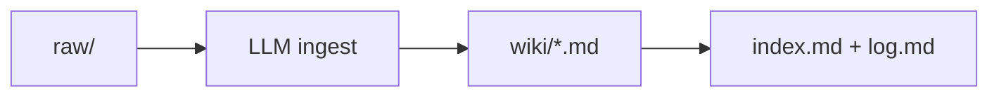

# CNCF TechDocs Analysis How-To

## Audience

This document is for members of the CNCF TechDocs team and others who wish to
conduct or assist with an analysis of a CNCF open-source project's technical
documentation.

## Purpose

The goals of a CNCF technical documentation analysis are to:

- Examine the current project technical documentation and website against the
  CNCF's analysis [criteria].
- Compare the documentation against the current or proposed [project maturity
  level].
- Recommend a program of key documentation improvements with the largest return
  on investment. These improvements are documented as _recommendations_ in the
  analysis document, and expanded in a companion
  [implementation plan](./templates/implementation.md) and
  [issues list](./templates/issues-list.md).

## Doing a Tech Docs Analysis

The tech docs analysis consists of some repository bookkeeping (prerequisites),
then of three overall tasks:

1. Write the analysis document: evaluate the existing project documentation with
   respect to the [project maturity level] or proposed maturity level, if the
   analysis is associated with a project upgrade request. Identify gaps with
   CNCF [criteria]. Write general recommendations to close the largest and most
   important identified issues.
2. Write a implementation plan: decompose recommendations in to specific
   improvement suggestions. These can be additions or revisions to the docs;
   reorganization; website infrastructure changes; or any other work that will
   close address issues. Make suggestions specific enough (for example, if you
   propose reorganizing a section then provide an outline) without being overly
   constraining so that a contributor could solve the problem differently if
   they have a different solution. For example, make it clear that your proposed
   outline is only one possible reorganization.
3. Write an issue backlog.

Finally, there are follow-up steps including:

- Creating GitHub issues and a pull request
- Getting approval from project maintainers

### Prerequisites

This section assumes you are familiar with GitHub repositories and pull requests
(PRs). If you need a refresher, see
[Get started](https://docs.github.com/en/get-started) from the GitHub docs.

Project analyses are kept in the
[CNCF tech docs repository](https://github.com/cncf/techdocs). Clone and prepare
for

1. Clone the [CNCF tech docs repository](https://github.com/cncf/techdocs).
2. Create a branch for the analysis.
3. In the new branch, create a directory for the analysis in the CNCF tech docs
   [analyses] directory. Name the directory `00NN-_PROJECT_`, where _NN_ is the
   next index available in the directory (check for PRs as well, if someone else
   is working on tech doc analyses), and where _PROJECT_ is a short but not
   abbreviated project name. For example, for Kubernetes _PROJECT_ would be
   _Kubernetes_, not _k8s_.
4. Copy all the doc analysis [templates].

### Writing the Analysis document

Follow the steps outlined below as a part of writing the project's analysis
document. Record your findings in the project's
[analysis.md](./templates/analysis.md) file.

1. Define the **scope** of the analysis. Edit "Scope of analysis" to reflect
   URLs and repositories included and excluded from the analysis.
2. Review the in-scope URLs and repositories for compliance with the rubric
   criteria. Note any gaps, as well as any areas that exceed criteria or are
   exceptionally well executed. I find it easiest to do this separately for each
   of the three areas of concern (project doc, contributor doc, website), making
   a pass through the documentation once for each section (Information
   architecture, New user content, Content maintainability, etc.). Don't worry
   about a numerical score during this step; instead, note how the documentation
   complies, or not, with each criterion with respect to the project maturity
   level (or proposed maturity level, if the analysis is part of a petition for
   upgrade). Write comments to note the most important gaps and best-executed
   features of the documentation.
3. Assign ratings to each criterion based on your comments and compliance with
   the maturity level expectations in the rubric. The ratings are
   self-explanatory. Keep in mind that "needs improvement" or "meets standards"
   is with respect to the current (or proposed) maturity level.
4. Write recommendations. The template implies that you'll do this for every
   criterion; the "Recommendations" headings mirror the "Comments" headings.
   However, if some alternative framework makes more sense, use that. For
   example, it might be that two or three of the product documentation criteria
   are improved by reorganizing the documentation. In this case, rather than
   repeat the recommendation to reorganize in each section, write a single
   recommendation and explain how it improves all the areas. This is the first
   step in moving from the analysis to specific, actionable, time-bound backlog
   items.

#### General tips

Things to keep in mind while doing the analysis:

- Look for:
  - Quick wins – low-effort changes that would have a major impact.
  - Large, systemic issues that you can organize a number of issues around.
  - The two or three most important issues that impede documentation
    effectiveness.
  - Anything the project does exceptionally well. We can call these out as
    examples in other evaluations!
- Don't get bogged down in detail when writing comments. Include enough detail
  that you can describe how to implement a suggested solution. A sentence or two
  is sufficient for most issues.
- Keep in mind the overall goal of the technical documentation: to make its
  users more effective. Focus on issues that get in the way of that goal.
- It is not necessary to come up with a recommendation in every case, especially
  for elements that are satisfactory or if a recommendation would result in
  minimal improvement.
- Don't worry about grammar and style if they don't affect documentation
  effectiveness. If writing style impedes understanding, make a note; otherwise
  move on. An exception: Insist that tasks and procedures be written as clear,
  step-by-step instructions.
- Some of the criteria, especially around contributor documentation, project
  governance, and website infrastructure, are essentially check-boxes. These you
  can quickly investigate, note, and move on. Spend more time analyzing the
  effectiveness of the project documentation.

#### Common issues

Many common issues seem to come about because open-source software documentation
is written by software developers while they are writing the software. This
results in documentation that:

1. Is organized around features, not users and use cases.
2. Explains technical concepts well, including architecture and design
   decisions.
3. Contains complete reference information for APIs, CLIs, and configuration
   parameters.
4. Has missing or incomplete user-oriented "how-to" explanations and operational
   procedures.

You may or may not find the following issues in your analysis, but it's worth
keeping them in mind:

- Ambiguity around user roles.
- Missing or unclear task-based documentation.
- Assumptions about the reader's level of knowledge.
- Organization that buries or scatters important information, especially tasks
  and procedures.
- Missing or unclear new-user workflows.

### Writing the implementation plan

Write the implementation plan. Edit the `_PROJECT_-implementation.md` file.

The gist of the implementation plan is to break down the recommendations in the
analysis document. This is an intermediate stage between general recommendations
and the issues backlog. For small projects and where the recommendations are
independent and time-bound, an implementation plan might not be necessary and
you can move straight to writing the backlog.

If you do write an implementation plan, start with recommendations in the
analysis document. Rewrite the recommendations, making them more specific, with
a suggested (but not mandatory) implementation. For example, if you recommend
reorganizing the documentation, provide a suggested outline, along with an
explanation of the reason for the reorg.

### Writing an issues backlog

Write an issues backlog. Edit `_PROJECT_-issues.md`.

The goal of writing an issues backlog is to offer project contributors the
opportunity to make the recommended changes.

Rewrite each action in the implementation plan. If possible, break large actions
into smaller issues. Each issue should be:

- Independent. As much as possible, no issue should have another issue as a
  prerequisite. A contributor should be able to choose an issue, resolve it, and
  close it without reference to any other issue.
- Time-bound. A contributor should be able to complete an issue in a reasonably
  short time, say a few hours or a couple of days at most.

Make the suggested solution even more specific. At this point, the issue should
almost be a recipe for making the doc improvement, with the caveat that a
contributor is not required to implement the solution as suggested in the issue.

## Next Steps

### Including supporting documentation

If you have supporting material that might be helpful to a contributor working
on the documentation issues, include them in the directory with the other
documents. For example, you might inventory the existing tech doc pages in a
spreadsheet; in this case, include a CSV file of the inventory.

### Creating a pull request

If you have not created a pull request with the analysis documents, do so now.
Tag project maintainers and CNCF documentation staff, and ask for comments.

### Getting contributor feedback

If you haven't met with the project's maintainers yet, do so before you create
the issues in GitHub. Ideally you'd like to have a Zoom meeting with any
interested parties to get feedback on the analysis and implementation plan.

### Creating GitHub issues

Create issues in the project documentation GitHub repository for:

- Each issues in the [issues list].
- An umbrella issue that provides a context for the previously created
  individual issues.

[analyses]: ../../analyses/
[criteria]: ./criteria.md
[project maturity level]: https://www.cncf.io/project-metrics
[templates]: ./templates/index.md
[issues list]: ./templates/issues-list.md

## Appendix A - Build an LLM Wiki for Analysis

This content for this appendix was itself generated by AI. Here is the prompt
originally used.

> Prompt: My job is to do analysis on CNCF project documentation. For other
> analysts to use, we have a how-to. For its AI section, I need you to create a
> doc plan for me to describe how to create an llm wiki, set the Model level and
> settings, bring in repositories or files (pros and cons of each), sample
> prompts for ingest/create wiki pages/update index. Generally, the best
> practices you can think of. Output your outline to how-to-wiki.md in the
> current directory.

> Audience: Analysts doing analysis on CNCF project documentation. Goal: Stand
> up and maintain an LLM-curated wiki (the "KubeMeow" pattern) that turns raw
> upstream docs into cross-linked, cited, synthesized knowledge pages.

## Overview & mental model

An Obsidian vault where raw source material is ingested and synthesized by an
LLM into curated, cross-linked, markdown pages. The core principal is that the
raw sources, `raw/`, are immutable and the wiki is derived. Every claim in a
wiki page traces back to a `raw/` path. There are three moving parts the analyst
drives:

- The AI agent (Copilot CLI)
- The vault (Obsidian)
- The source corpus (`raw/`).



## Setup

To set up an LLM wiki, perform the following steps. (Alternatively, you can
install the
[Karpathy LLM Wiki - Obsidian Plugin](https://community.obsidian.md/plugins/karpathywiki)).

1. Create the wiki structure as shown here. Replace `my-research` with the name
   for wiki. For CNCF analysis, the wiki should be exclusive to one project so
   use the project name in the wiki's name.

   ```text
   my-research/
   ├── raw/                    # Layer 1: Immutable source documents
   │   ├── articles/
   │   ├── papers/
   │   ├── repos/
   │   ├── data/
   │   ├── images/
   │   └── assets/
   ├── wiki/                   # Layer 2: LLM-generated markdown
   │   ├── index.md            # Content catalog (updated on every ingest)
   │   ├── log.md              # Append-only chronological record
   │   ├── overview.md
   │   ├── concepts/           # Concept pages
   │   ├── entities/           # Entity pages
   │   ├── sources/            # Source summaries
   │   └── comparisons/        # Comparison pages
   ├── outputs/                # Dated reports, presentations
   ├── CLAUDE.md               # Layer 3: Schema configuration
   └── .gitignore
   ```

   | Path                                       | Purpose                                            | Editable by AI?   |
   | ------------------------------------------ | -------------------------------------------------- | ----------------- |
   | `raw/topics/<topic>/`                      | Immutable verbatim source checkouts                | Never             |
   | `raw/{articles,data,images,papers,repos}/` | Placeholders for other source types                | Never             |
   | `wiki/`                                    | Synthesized concept/entity pages (the deliverable) | Yes               |
   | `wiki/sources/`                            | One source-summary page per ingested source        | Yes               |
   | `wiki/{comparisons,concepts,entities}/`    | Category placeholders                              | Yes               |
   | `wiki/index.md`                            | Master catalog + coverage map                      | Every op          |
   | `wiki/log.md`                              | Append-only operation history (newest on top)      | Every op          |
   | `outputs/`                                 | Generated reports (e.g. `lint-YYYY-MM-DD.md`)      | Yes               |
   | `.obsidian/`, `*.base`, `*.canvas`         | Obsidian app artifacts                             | Leave to Obsidian |

   Run the following bash commands create this structure:

   ```bash
   mkdir -p ~/research/my-topic/{raw/{articles,papers,repos,data,images},wiki/{concepts,entities,sources,comparisons},outputs}
   touch ~/research/my-topic/wiki/index.md
   touch ~/research/my-topic/wiki/log.md
   ```

1. Install tools:
   - [Obsidian](https://obsidian.md/download)
   - [Git](https://https://git-scm.com/install/)
   - [GitHub CLI](https://cli.github.com/) and the LLM agent (GitHub Copilot
     CLI).

1. In Obsidian, open the command pallet and set the vault name to the name of
   your wiki.

1. Author the `.github/copilot-instructions.md`file, an important step for
   achieving successful results. See
   [Agent constitution](#agent-constitution---copilot-instructions-markdown-file)
   for authoring the `copilot-instructions.md` file that resides at the root of
   the wiki.

## Choose model tier & refine settings

Choose the model level desired, and fine tune with the settings. Heavier
reasoning models produce better synthesis but costs more and runs slower.

## Model tier

The Copilot CLI lets you switch models, including within a session. Run
`/model`and select.

| Wiki task                             | Model tier                               | Why                                                         |
| ------------------------------------- | ---------------------------------------- | ----------------------------------------------------------- |
| Ingest + synthesize a large corpus    | High-reasoning (e.g. Opus / GPT-5-class) | Cross-doc synthesis, contradiction detection, deduplication |
| Create/rewrite a concept page         | High-reasoning                           | Quality of prose + citation accuracy matters most           |
| Query / Q&A over existing wiki        | Mid tier                                 | Retrieval + short synthesis; cheaper                        |
| Lint / mechanical index & log updates | Fast/low tier                            | Deterministic, low-creativity edits                         |

(TODO: confirm exact command/label in your CLI version and pick effort/verbosity
where offered.)

## Critical settings

For each model tier, you can control its access, scope, strength, time, and
other factors.

| Wiki setting                                                  | Recommended configuration                                                                                                               |
| ------------------------------------------------------------- | --------------------------------------------------------------------------------------------------------------------------------------- |
| Custom instructions (`.github/copilot-instructions.md`)       | Refine for your project.                                                                                                                |
| Permissions (`.claude/settings.local.json` or CLI equivalent) | Allow-list read paths, prose synthesis, `gh api`, and package installs. Keep write scope tight.                                         |
| Temperature / determinism                                     | Prefer low creativity for index/log/lint ops (TODO: note where this is exposed in your CLI.)                                            |
| Context window / long-context tier                            | When a corpus is large, use a long-context mode or delegate sub-sections to sub-agents rather than stuffing everything into one prompt. |
| Session artifacts vs. committed files                         | Planning notes live in the agent's session state, not the vault. Only `wiki/`, `index.md`, `log.md`, `outputs/` get committed.          |

## Agent Constitution - copilot-instructions Markdown file

The instructions are at the repository level, enabling results that are
repeatable across analysts and sessions. Without it, every analyst gets
different structure. Workflows: Ingest, Query, and Lint. Page conventions:
frontmatter schema, kebab-case filenames, `[[wikilinks]]` only, "synthesize
don't copy," date format. Watch out for cross-topic bleed, ensure `index.md` and
`log.md` are in sync. Things to watch": cross-topic bleed, keeping
`index.md`/`log.md` in sync. Best practice: treat the instructions file as
versioned policy — review it when conventions change; it is the contract the
agent follows.

## Bringing in Source Material: Repositories vs. Files

You can bring a documentation set for analysis as either a reference to a GitHub
repository in `raw/repos` or as a structure of files in `raw/articles` you can
rename `articles` to `topics` or define other types of sources in `raw/'.

### How ingestion sources land in `raw/`

All files in `/raw/topics/` should be the most recent sources for the project.

- Everything goes under `raw/topics/<topic>/` as a verbatim checkout/copy. Never
  hand-edit.
- Record provenance (upstream URL + branch/commit) in the source-summary page
  and `log.md`.

### 4b. Option A — Bring in a whole repository

To add a repo to the wiki, in the `raw/repos/` folder, run
`git clone https://github.com/<rest-of-url>.git`. You can also ask the agent to
do it in a prompt with the URL.

(This repo's Flatcar topic is a checkout of `flatcar/flatcar-website`,
`expert-support-refactor` branch.)

| Pros                                                               | Cons                                                                         |
| ------------------------------------------------------------------ | ---------------------------------------------------------------------------- |
| Complete coverage — nothing missed                                 | Pulls in non-content noise (Hugo templates, CI, `Makefile`, repo meta)       |
| Exact provenance (branch/commit is pinnable & reproducible)        | Larger footprint; slower first ingest                                        |
| Easy to re-ingest on upstream changes (`git pull` → re-run ingest) | Must explicitly exclude meta files (see this repo's "Excluded Files" list)   |
| Preserves upstream structure → clean section→page mapping          | Risk of accidentally running upstream tooling (don't run `raw/`'s Makefiles) |
| Diffs show exactly what changed between ingests                    | Branch churn can silently move/rename sections (must audit)                  |

### 4c. Option B — Bring in individual files

- _How:_ copy specific docs/PDFs/articles into `raw/topics/<topic>/` (or
  `raw/articles/`, `raw/papers/`).

| Pros                                                   | Cons                                                  |
| ------------------------------------------------------ | ----------------------------------------------------- |
| Minimal noise — only what you need                     | Provenance is manual and easy to lose                 |
| Fast to ingest; small footprint                        | No automatic re-ingest path; updates are manual       |
| Good for one-off articles, papers, PDFs, mixed formats | Coverage gaps: easy to forget a related file          |
| No upstream tooling comes along                        | No structural map to derive section→page mapping from |
| Easy when there is no single upstream repo             | Harder to prove "this is the complete source set"     |

### 4d. Decision guidance

- Whole repo when: source is a single upstream docs repo, you'll track it over
  time, and reproducibility matters (the default for CNCF project docs).
- Individual files when: sources are scattered (blogs, papers, PDFs), one-off,
  or you only need a slice.
- Either way: always create a `wiki/sources/<source>.md` summary that records
  what was ingested, counts, and what was deliberately excluded.

## §5. Workflow — Ingest

_What to write:_ step list + copyable prompts (the "sample prompts for ingest"
requirement).

_Steps:_ read source under `raw/` → discuss key takeaways → create/update
`wiki/sources/<source>.md` → create/update concept/entity pages → update
`wiki/index.md` → append to `wiki/log.md`.

Sample prompt — full ingest:

```
Ingest the source at raw/topics/<topic>/. Read it in full, then:
1. Summarize the key takeaways and propose a section→page mapping before writing.
2. Create wiki/sources/<topic>-docs.md capturing what's covered, file counts, and
   any files deliberately excluded (repo meta, templates, boilerplate).
3. Create/update the concept & entity pages, one per major section. Every page must
   have YAML frontmatter (title, type, sources, related, created, updated, confidence),
   kebab-case <topic>-<subtopic>.md filenames, and [[wikilinks]] for all internal links.
4. Synthesize — condense sources into concise prose and comparison tables; do NOT copy
   verbatim. Every claim must cite a raw/ path.
5. Update wiki/index.md (catalog + coverage map) and append a dated entry to the top of
   wiki/log.md.
Do not edit anything under raw/. Do not run any tooling inside raw/.
```

Sample prompt — re-ingest after upstream changes:

```
The files under raw/topics/<topic>/ were updated. Re-ingest:
- Diff current sources against what the existing pages cover.
- Report source growth (new/renamed/removed sections) as a table.
- Re-synthesize affected pages, bump their `updated:` date, and expand `sources:`.
- Refresh index.md counts/coverage map and append a log.md entry describing the delta.
```

_Best practices to note:_ ask the agent to propose the mapping before writing;
ingest one topic at a time; for very large corpora, delegate sections to
sub-agents.

## §6. Workflow — Create / Update Wiki Pages

_What to write:_ the page contract + prompts (the "create wiki pages / update
index" requirement).

- Frontmatter schema (show verbatim; every page starts with this):

```yaml
---
title: 'Human Readable Title'
type: concept # concept | entity | source-summary | comparison
sources:
  - raw/topics/<topic>/content/docs/latest/<section>/
related:
  - '[[<topic>-overview]]'
created: YYYY-MM-DD
updated: YYYY-MM-DD
confidence: high # high | medium | low
---
```

- Rules: kebab-case filenames; `[[wikilinks]]` never relative paths; synthesize
  don't copy; bump `updated:` on every change; `confidence:` reflects source
  strength.

Sample prompt — new concept page:

```
Create wiki/<topic>-<subtopic>.md as a `concept` page synthesizing the sources under
raw/topics/<topic>/.../<section>/. Use the standard frontmatter, cite every claim to a
raw/ path, prefer comparison tables over prose where it aids scanning, and add [[wikilinks]]
to related pages. Then update index.md and append to log.md.
```

Sample prompt — update index:

```
Update wiki/index.md: ensure every page in wiki/ and wiki/sources/ appears in the catalog
tables with an accurate one-line summary, and refresh the coverage map (section → page,
with current file counts). Flag any orphan pages (no incoming [[links]]) or catalog entries
whose files no longer exist.
```

Sample prompt — append to log:

```
Append a new dated entry to the TOP of wiki/log.md describing this operation: operation type,
source, reason, pages created/updated, and index changes. Keep newest-on-top ordering.
```

## §7. Workflow — Lint (Content Consistency, not Code)

_What to write:_ what "lint" means for a wiki + prompt.

- Checks: contradictions across pages, orphan pages (no incoming links),
  referenced-but-missing concepts (dangling `[[wikilinks]]`), and stale claims
  superseded by newer sources.
- Output goes to `outputs/lint-YYYY-MM-DD.md` (not into the wiki pages
  themselves).

Sample prompt — lint:

```
Lint the wiki for content consistency (not code). Scan all wiki pages for: contradictions
between pages, orphan pages with no incoming [[links]], dangling wikilinks to pages that
don't exist, and stale claims superseded by newer sources. Write findings to
outputs/lint-<today>.md with file/line references and suggested fixes. Do not modify wiki
pages in this pass.
```

## §8. Workflow — Query / Q&A

_What to write:_ how analysts pull answers back out.

- Steps: read `index.md` to find relevant pages → read them → synthesize →
  answer with `[[wikilink]]` citations → offer to save a novel, valuable answer
  as a new page.

Sample prompt — query:

```
Using the wiki, answer: "<question>". Start from index.md to locate relevant pages, read
them, synthesize a cited answer using [[wikilinks]], and if the answer is novel and reusable,
offer to save it as a new comparison/concept page.
```

## §9. Cross-Topic Hygiene & Auditing

_What to write:_

- Cross-topic bleed: when a topic is dropped, audit remaining pages for stray
  links to it — check both `related:` frontmatter and body content. (Reference
  the KubeVirt bleed audit in `log.md` as the worked example.)
- Retain source-derived content that legitimately belongs to the kept topic even
  if it _names_ the removed one (e.g. Flatcar-on-KubeVirt deploy docs stay).
- Keep `index.md` and `log.md` as the source of truth for what exists and what
  happened.

## §10. Best Practices (Cheat Sheet)

_What to write — the "best practices" requirement, as a scannable list:_

- Raw is sacred. Never edit/move/delete `raw/`; never run tooling that lives
  inside it.
- Cite everything. Every claim → a `raw/` path; every page → `sources:`
  frontmatter.
- Synthesize, don't copy. Pages are condensed prose + tables, not reproductions.
- One source of truth. Update `index.md` and append `log.md` on _every_
  operation.
- Ask before writing. Have the agent propose a section→page mapping first.
- Pin provenance. Record upstream URL + branch/commit for reproducible
  re-ingests.
- Prefer whole-repo ingest for trackable CNCF docs; files for one-offs (see §4).
- Right-size the model (§2): high-reasoning for synthesis, fast for mechanical
  ops.
- Small, verifiable steps. Ingest one topic at a time; lint regularly.
- Keep planning out of the vault. Use session state, commit only deliverables.
- Version the constitution. Review `copilot-instructions.md` when conventions
  change.
- Date discipline. `YYYY-MM-DD`; bump `updated:` whenever a page changes.

## §11. Troubleshooting & FAQ

_What to write:_ a short table.

- Agent edited `raw/` → revert; strengthen instructions; re-run.
- Pages drifted from sources → re-ingest (§5) and diff.
- Broken `[[wikilinks]]` / orphans → run lint (§7).
- Duplicate/overlapping pages → merge, add cross-links, update `index.md`.
- Agent ran upstream Makefile/scripts → forbidden; reaffirm the "don't run
  `raw/` tooling" rule.
- _TODO: add real incidents analysts hit in practice._

## §12. Appendix

_What to write / attach:_

- Full copy of `.github/copilot-instructions.md` (or link).
- The exact model + settings your team standardized on. _TODO: fill in._
- Glossary: ingest, synthesize, concept/entity/source-summary/comparison page,
  coverage map, cross-topic bleed, orphan page.
- Links: Obsidian, Copilot CLI docs, the upstream source repos in `raw/`.
